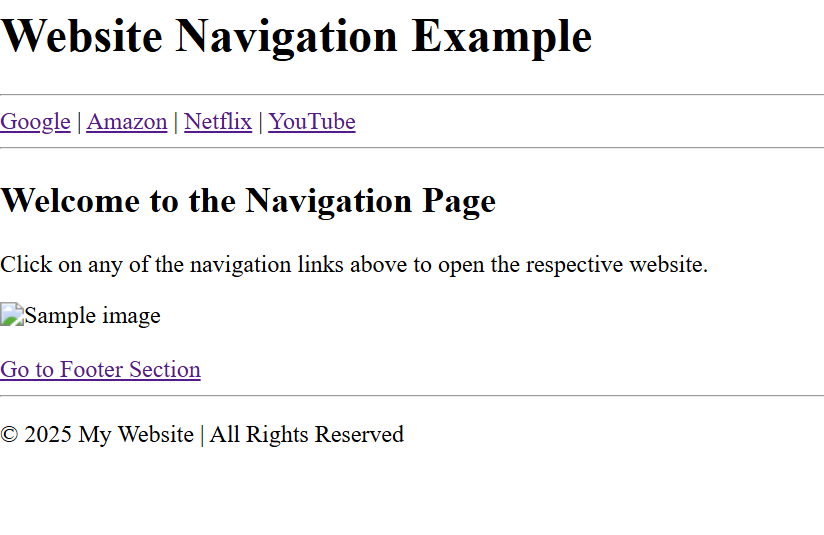

# HTML Navigation Tags Example

This is a simple HTML file that demonstrates how to create **navigation links** using the `<nav>` and `<a>` tags — **without using CSS or JavaScript**.

---

##  Description

The HTML file shows how to:
- Create a navigation bar using `<nav>`
- Add multiple links using `<a>`
- Open links in the same tab or a new tab
- Include a footer and image for completeness

---

##  HTML Concepts Used

| Tag | Purpose |
|------|----------|
| `<nav>` | Defines a navigation section |
| `<a>` | Creates a hyperlink to another page or website |
| `target="_blank"` | Opens a link in a new tab |
| `<footer>` | Adds a footer section to the page |
| `` | Displays an image |

---

##  How to View

1. Open the `NavigationEXample.html` file in your browser.  
2. Click on the navigation links to see how each one behaves.  
3. No CSS or JavaScript is used — only pure HTML.

---

##  Created For

Basic HTML learning and practice — focusing on understanding **navigation tags** and hyperlink behavior.

---

## 🪪 License

This is a free educational example — you can use or modify it freely.

## Output

